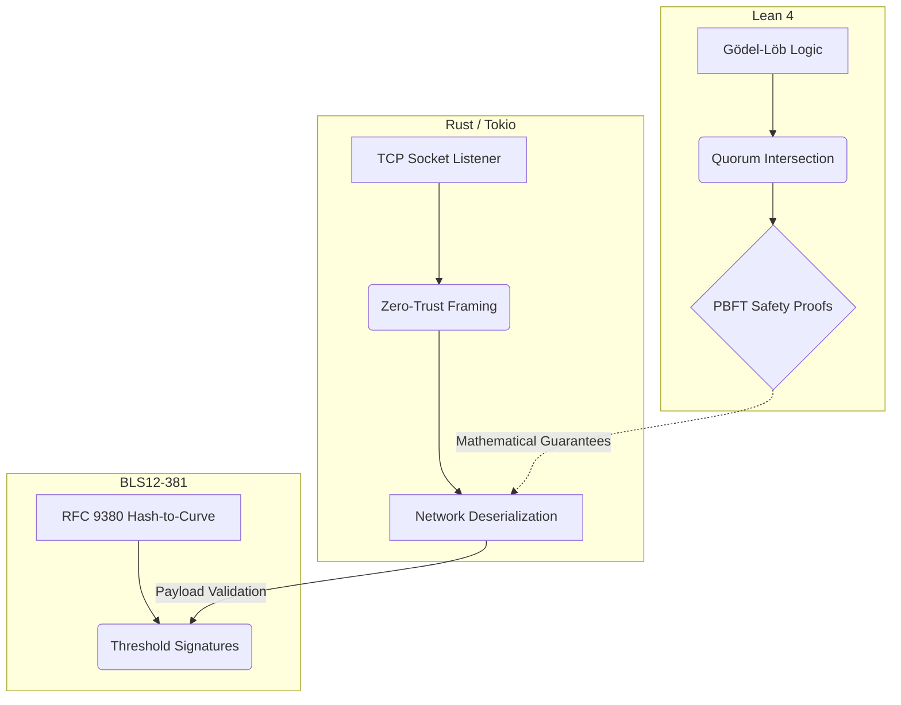

<div align="center">

# ⬡ SOVEREIGN LATTICE

**Formally Verified Asynchronous PBFT Consensus Engine**

[](https://github.com/aixaria0/SOVEREIGN_LATTICE/actions)
[](https://www.rust-lang.org/)
[](https://leanprover.github.io/)
[](https://github.com/aixaria0/SOVEREIGN_LATTICE)
[](https://opensource.org/licenses/Apache-2.0)

<br>

### 🌐 [LAUNCH LIVE COMMAND CENTER](https://aixaria0.github.io/SOVEREIGN_LATTICE/)

</div>

---

## 📑 Table of Contents
- [Executive Summary](#-executive-summary)
- [System Architecture](#-system-architecture)
- [Key Innovations](#-key-innovations)
- [Repository Structure](#-repository-structure)
- [Verification & Audit Status](#-verification--audit-status)
- [Quick Start & Deployment](#-quick-start--deployment)
- [Roadmap](#-roadmap)

---

## 📖 Executive Summary

> **Sovereign Lattice** is an experimental research prototype demonstrating the architectural integration of strict formal mathematical proofs (**Lean 4**) with a high-performance, asynchronous Byzantine Fault Tolerant (PBFT) networking engine (**Rust**).

Unlike standard distributed consensus engines that rely purely on runtime testing and probabilistic security, this project establishes its foundational safety guarantees at the strict mathematical level using **Gödel-Löb Provability Logic**. Simultaneously, it executes real-time cryptographic validation via Tokio's asynchronous runtime, ensuring that empirical performance matches theoretical safety.

---

## 📐 System Architecture

The architecture bridges the gap between theoretical consensus models and live network execution through three isolated but strictly interconnected layers. 



---

## ✨ Key Innovations

### 🧠 1. Formal Verification (Lean 4)
The absolute truth of the consensus engine is strictly verified in the `formal_verification/GodelLobBFT.lean` environment.
* **Quorum Intersection:** Mathematically proven that no two honest quorums can intersect at a Byzantine node under the $f < n/3$ assumption.
* **PBFT Safety:** Formally verified that `Commit implies Prepare` and `Honest Prepare Uniqueness`, ensuring two conflicting block digests can **never** be committed at the same sequence height.

### 🔐 2. Cryptographic Core (Rust)
No mock cryptography. The engine evaluates actual, computationally heavy cryptographic signatures on the fly.
# SOVEREIGN LATTICE: Formally Verified PBFT & BLS Consensus Prototype

## Architectural Status
* **Formal Core (Lean 4):** 100% formally verified safety core (`PBFT_Safety`, Quorum Intersection, and HonestState uniqueness) without axioms or `sorry`.
* **Consensus Runtime (Rust):** PBFT state machine enforcing $2f+1$ quorum rules and strict equivocation checks matching the Lean model invariants.
* **Cryptography (BLS12-381):** Algebraic pairing-based signature validation prototype (Note: Hash-to-curve uses a simplified algebraic scalar mapping rather than full RFC 9380 SSWU pipeline, intended for research and simulation purposes).
(`BLS12381G1_XMD:SHA-256_SSWU_RO_NUL_`), strictly preventing cross-protocol vulnerabilities.
* **Threshold BLS12-381:** Utilizes optimal ate pairings $e(\sigma, G_2) == e(H(m), pk)$ to securely verify payload integrity before any state transitions occur.

### ⚡ 3. Asynchronous Transport (Tokio)
* **Zero-Trust Framing:** Implementation of strict 4-byte length-prefixed payload framing to prevent stream corruption.
* **Memory Exhaustion Mitigation:** Hardcoded byte boundaries (40 to 4096 bytes) automatically drop malformed, oversized, or microscopic frames *before* they reach the deserialization layer, rendering DOS attacks ineffective.

---

## 🗂️ Repository Structure

```text
.
├── formal_verification/     # Lean 4 proofs & Gödel-Löb BFT theorems
│   ├── GodelLobBFT.lean     # Core formalization of safety constraints
│   └── lakefile.lean        # Lean package configuration
├── rust_engine/             # Tokio-based async TCP daemon
│   ├── src/
│   │   ├── main.rs          # Core runtime & lifecycle manager
│   │   ├── network.rs       # Length-prefixed framing & socket handler
│   │   ├── threshold_bls.rs # RFC 9380 compliant cryptographic primitives
│   │   └── bin/injector.rs  # CLI tool for zero-trust payload injection
│   └── Cargo.toml           # Rust dependencies (tokio, bls12_381, sha2)
└── index.html               # Web-based Telemetry & Command Console
```

---

## 🛡️ Verification & Audit Status

The current commit workflows are fully automated via GitHub Actions on every push:
- `lake build` (Lean 4 Formal Proofs Compilation)
- `cargo test --workspace --all-features` (Rust Unit & Integration Tests)
- `cargo clippy --workspace --all-targets --all-features -- -D warnings` (Strict Linter)

> **⚠️ Note on Production Readiness:** These automated checks confirm reproducible builds, structural BFT conditions, and strict compiler hygiene in a documented environment. This repository is currently an **experimental research prototype**. It is not an independent security audit, and the Lean model formally verifies structural PBFT conditions, not the compiled Rust binary itself. 

---

## 🚀 Quick Start & Deployment

### Prerequisites
* Rust Toolchain (`cargo`, `rustc`) v1.70+
* Lean 4 (`elan`, `lake`)

### 1. Boot the Secure Daemon
Launch the asynchronous network engine on your local environment (Listening on `127.0.0.1:8080`):
```bash
cd rust_engine
cargo run
```

### 2. Inject Test Payloads
In a separate terminal window, use the built-in injector to test network framing and cryptographic payload ingestion. The daemon will parse, verify, and acknowledge the sequence in real-time.
```bash
cd rust_engine
cargo run --bin injector
```

---

## 🗺️ Roadmap / Future Work

- [x] Integrate standard RFC 9380 Hash-to-Curve mapping.
- [x] Discharge "Commit implies Prepare" Lean 4 axioms.
- [x] Implement hardened length-prefixed TCP framing.
- [ ] Transition from static dummy genesis keys to dynamic Feldman DKG.
- [ ] Connect the Lean 4 extraction directly to Rust FFI bindings.

---

<div align="center">
  <br>
  <b>Architect:</b> AixAria | <a href="[https://github.com/aixaria0](https://github.com/aixaria0)">@aixaria0</a> <br>
  <i>Built at the intersection of Formal Logic and Distributed Systems.</i>
</div>
